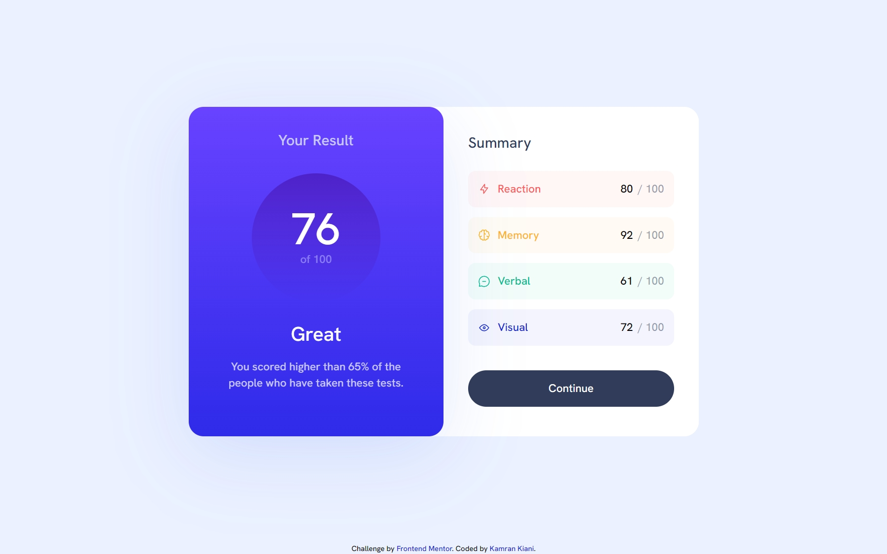

# Frontend Mentor - Results summary component solution

This is a solution to the [Results summary component challenge on Frontend Mentor](https://www.frontendmentor.io/challenges/results-summary-component-CE_K6s0maV).

## Table of contents

- [Overview](#overview)
  - [The challenge](#the-challenge)
  - [Screenshot](#screenshot)
  - [Links](#links)
- [My process](#my-process)
  - [Built with](#built-with)
  - [What I learned](#what-i-learned)
  - [Continued development](#continued-development)
  - [Useful resources](#useful-resources)
- [Author](#author)
- [Acknowledgments](#acknowledgments)

## Overview

### The challenge

Users should be able to:

- View the optimal layout for the interface depending on their device's screen size
- See hover and focus states for all interactive elements on the page
- **Bonus**: Use the local JSON data to dynamically populate the content

### Screenshot

### Links

- Solution URL: [Add solution URL here](https://your-solution-url.com)
- Live Site URL: [Vercel Live Preview](https://github.com/kaamiik/fm-Result-Summary-Component-using-react-tailwind)

## My process

### Built with

- Semantic HTML5 markup
- Tailwind CSS
- Flexbox
- CSS Grid
- Mobile-first workflow
- [React](https://reactjs.org/) - JS library
- Accessibility
- Vite

### What I learned

This project was my first experience using React, and I chose Vite as the build tool to streamline the development process. It was a great opportunity to dive into component-based architecture, which helped me understand how to break down the UI into reusable pieces.

For styling, I utilized Tailwind CSS, which significantly sped up the design process with its utility-first approach. However, integrating Tailwind with React components presented some challenges, particularly in ensuring styles were applied correctly across different components.

Another key learning point was fetching and handling JSON data. I implemented asynchronous data fetching to dynamically populate the content, which was a valuable exercise in managing state and handling potential errors in a React application.

## Author

- Frontend Mentor - [@kaamiik](https://www.frontendmentor.io/profile/kaamiik)
- X - [@kiaakamran](https://www.X.com/kiaakamran)

## Acknowledgments

Thanks to **Grace Snow** and **Alex Marshall** from the Frontend Mentor Discord community for theire guidances in my problems during the challenges, which helped me build this project and other projects with fewer problems.
